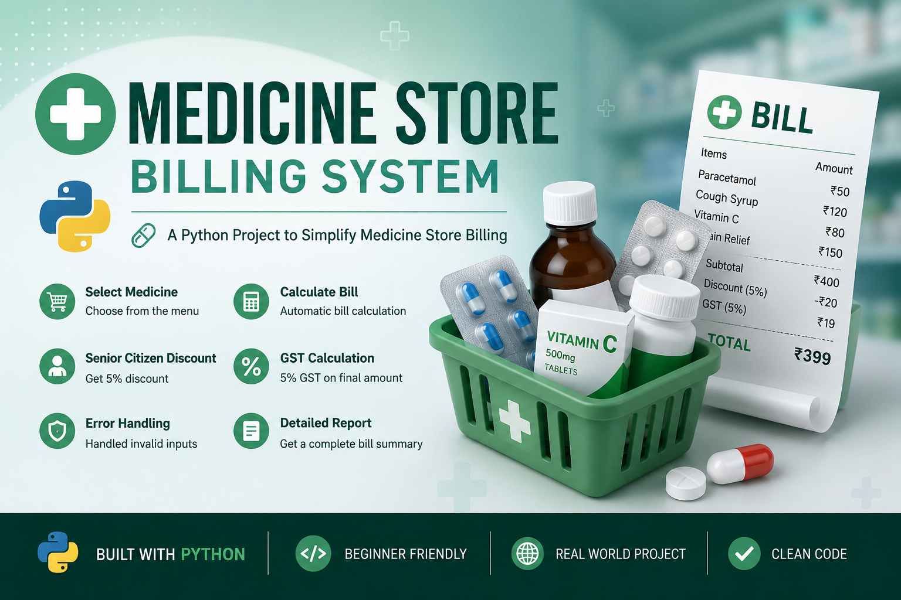

# pharmacy-medical-calculation-system
💊 A beginner-friendly Python medicine billing system with GST, senior citizen discount, and exception handling.
## ✨ Features

- Medicine Selection
- Quantity Calculation
- Senior Citizen Discount
- GST Calculation
- Exception Handling
- Final Bill Generation

## 🛠️ Concepts Used

- Functions
- if-elif-else
- try-except
- return
- User Input
- 
# python
# python-project
# beginner
# billing-system
# medicine-store
# exception-handling
# functions
